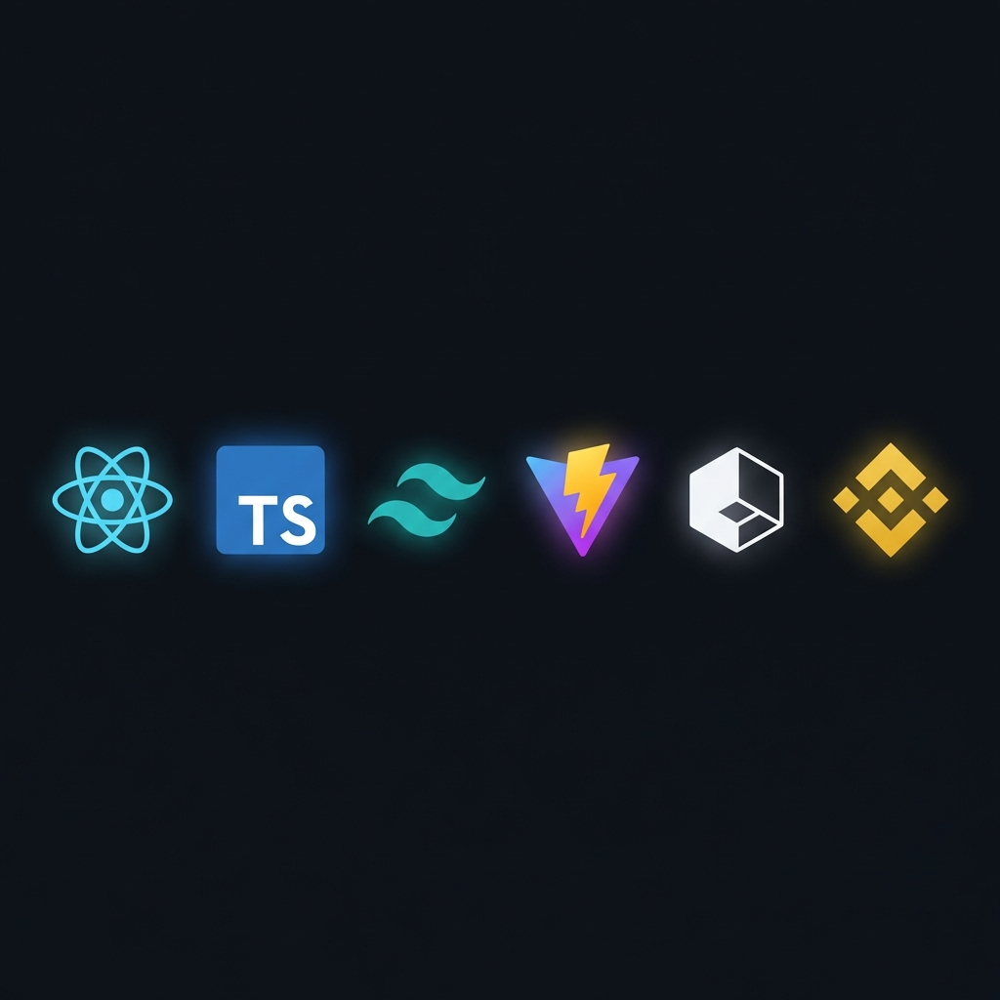
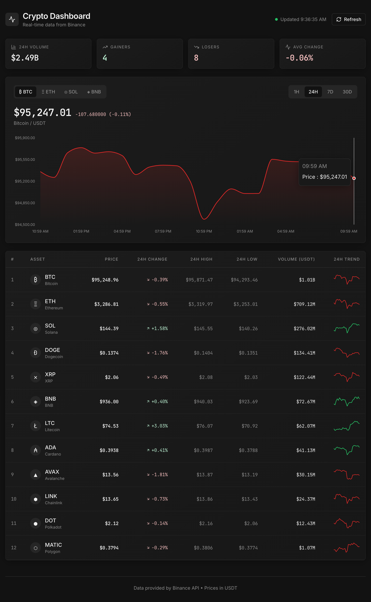

<div align="center">

  

  # CRYPTO DASHBOARD

  <p>
    <a href="#features">
      
    </a>
    <a href="#tech-stack">
      
    </a>
    <a href="#license">
      
    </a>
  </p>

  <h3>
    <i>"Real-time market intelligence at your fingertips."</i>
  </h3>

</div>

<br />

## ⚡ Overview

A professional-grade cryptocurrency dashboard engineered for performance and aesthetics. Powered by the **Binance API**, it delivers live market data, interactive candlestick charts, and comprehensive 24h statistics in a sleek, dark-mode interface.

<br />



---

## 💎 Key Features

- **Live Ticker**: Real-time price updates for top cryptocurrencies.
- **Dynamic Charts**: Interactive, responsive candlestick charts powered by `Recharts`.
- **Market Analysis**: 24h volume, high/low, and percentage change stats.
- **Modern UI**: A refined dark theme built with `shadcn/ui` and `Tailwind CSS`.
- **Zero Latency**: Optimized for blazing fast performance with `Vite`.

---

## 🛠 Tech Stack

Built with a curated selection of modern web technologies.

| Core | Styling | Tooling |
| :--- | :--- | :--- |
|  |  |  |
|  |  |  |

---

## 🚀 Quick Start

Initialize the project locally in seconds.

```bash
# 1. Clone
git clone https://github.com/MISTERKID/cryptodashboard
cd cryptodashboard

# 2. Install
npm install

# 3. Run
npm run dev
```

Visit `http://localhost:8080` to view the dashboard.

---

<div align="center">
  <br />
  <sub>Designed & Developed by MISTERKID</sub>
  <br />
</div>
